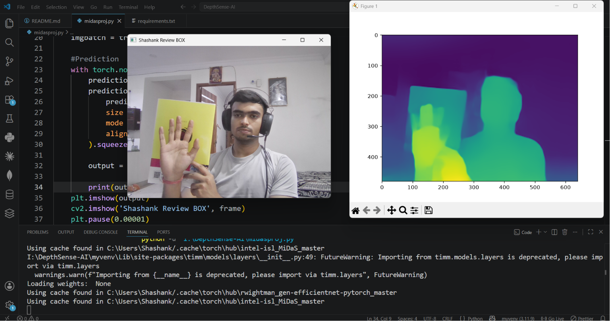
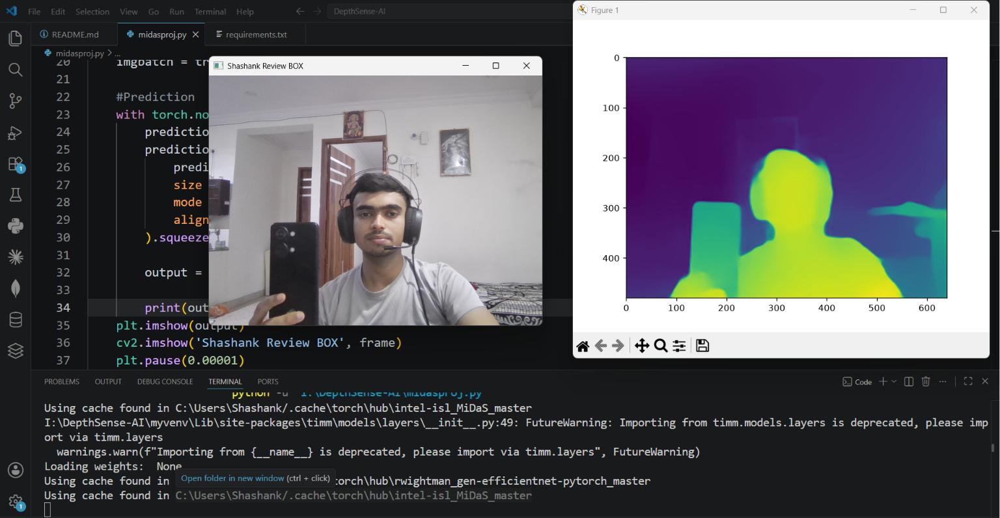

# DepthSense-AI

### Real-Time Monocular Depth Estimation Using MiDaS

<p align="center">
  
  
</p>

<p align="center">
  
  
  
  
  
</p>

## Overview

DepthSense-AI is a Computer Vision project that performs **real-time monocular depth estimation** using Intel's MiDaS model. Unlike traditional depth sensing systems that require stereo cameras, LiDAR, or specialized hardware, this project predicts scene depth from a **single RGB camera feed**.

The application captures live video from a webcam, processes each frame through the MiDaS neural network, and generates a depth map that estimates the relative distance of objects in the scene.

---

## What is MiDaS?

**MiDaS (Mixed Depth and Scale Estimation)** is a state-of-the-art monocular depth estimation framework developed by researchers at Intel.

MiDaS uses deep learning to infer depth information from a single image by learning visual cues such as:

* Perspective geometry
* Relative object size
* Occlusion relationships
* Texture gradients
* Scene semantics
* Lighting and shadow patterns

Unlike LiDAR or stereo vision systems, MiDaS does not directly measure physical distance. Instead, it predicts a **relative depth map**, where brighter and darker regions represent objects that are closer or farther away from the camera.

This enables depth perception using only a standard RGB camera.

---

## Project Features

* Real-time webcam depth estimation
* Single-image (monocular) depth prediction
* Powered by Intel's MiDaS Small model
* Live visualization of depth maps
* Lightweight and easy to run
* No additional hardware required

---

## Project Workflow

```text
Webcam Input
      │
      ▼
Capture Video Frame
      │
      ▼
RGB Conversion (OpenCV)
      │
      ▼
MiDaS Transform Pipeline
      │
      ▼
MiDaS Neural Network
      │
      ▼
Depth Prediction
      │
      ▼
Interpolation & Resizing
      │
      ▼
Depth Map Visualization
      │
      ▼
Live Display
```

### Step-by-Step Process

1. Capture video frames from the webcam using OpenCV.
2. Convert frames from BGR to RGB format.
3. Apply MiDaS preprocessing transformations.
4. Feed the transformed image into the MiDaS model.
5. Generate depth predictions.
6. Resize predictions to match the original image dimensions.
7. Convert the output tensor to a NumPy array.
8. Visualize the depth map using Matplotlib.
9. Display the original webcam feed in real time.

---

## Technologies Used

| Category               | Technology  |
| ---------------------- | ----------- |
| Programming Language   | Python      |
| Computer Vision        | OpenCV      |
| Deep Learning          | PyTorch     |
| Depth Estimation Model | MiDaS Small |
| Visualization          | Matplotlib  |
| Numerical Computing    | NumPy       |

---

## Libraries Used

### OpenCV (`cv2`)

Used for:

* Webcam access
* Frame capture
* Color space conversion
* Real-time display windows

### PyTorch (`torch`)

Used for:

* Loading the MiDaS model
* Neural network inference
* Tensor operations
* Depth prediction

### TorchVision

Provides computer vision utilities and support for PyTorch-based image processing workflows.

### Matplotlib

Used for:

* Rendering depth maps
* Real-time visualization of model output

### NumPy

Used for:

* Numerical array operations
* Converting PyTorch tensors into visualizable formats

---

## Installation

Clone the repository:

```bash
git clone https://github.com/yourusername/DepthSense-AI.git
cd DepthSense-AI
```

Install dependencies:

```bash
pip install -r requirements.txt
```

---

## Requirements

```text
opencv-python
torch
torchvision
matplotlib
numpy
```

---

## Running the Project

```bash
python midasproj.py
```

Press **Q** to exit the application.

---

## Future Enhancements

* GPU acceleration using CUDA
* Distance estimation calibration
* Depth-based object detection
* 3D scene reconstruction
* AR/VR integration
* Obstacle detection for robotics
* Depth map recording and export

---

## Applications

* Autonomous Navigation
* Robotics
* Augmented Reality (AR)
* Virtual Reality (VR)
* Scene Understanding
* Human-Computer Interaction
* Smart Surveillance Systems

---

## Acknowledgements

* Intel MiDaS Research Team
* PyTorch Community
* OpenCV Community

---

## Author

**Shashank K**

Computer Vision • Artificial Intelligence • Machine Learning

*"Enabling machines to perceive depth from a single image."*
